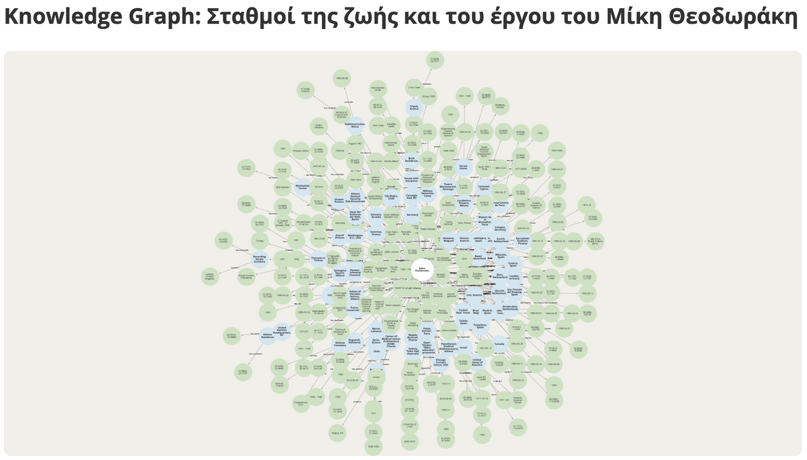
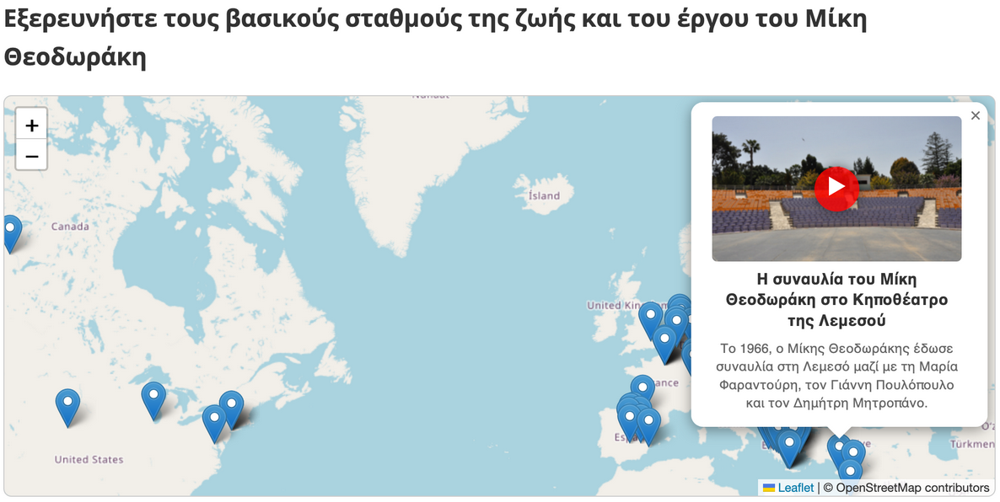

## Mapping the life and memorial sites of Mikis Theodorakis
This project is a web-based multimedia platform designed to map the key milestones, international journeys, and memorial sites associated with the life and work of the Greek composer, Mikis Theodorakis. 

### Live demo
You can explore the interactive platform live here: **[ioannats04.github.io/theodorakis-project](https://ioannats04.github.io/theodorakis-project/)**

### Platform preview
| Knowledge Graph (Cytoscape) | Interactive Map (Leaflet) |
|---|---|
|  |  |

### Features
* Short Biography
* Family Tree
* Interactive Maps
* Knowledge Graphs
* Responsive Design

### Tech stack
* HTML5
* CSS3
* JavaScript
* Leaflet.js & OpenStreetMap: JavaScript library and map tile provider used for rendering the interactive maps.
* Cytoscape.js: JavaScript library used for rendering the interactive knowledge graphs.

### Project identity
*   **Creator:** Ioanna Tsiara (Undergraduate Student, Department of Philology, Linguistics Sector)
*   **Supervisor:** Maria Papadopoulou (Assistant Professor, Department of Philology)
*   **Institution:** University of Crete
*   **Academic Program:** TALOS AI4SSH Project | 2026
